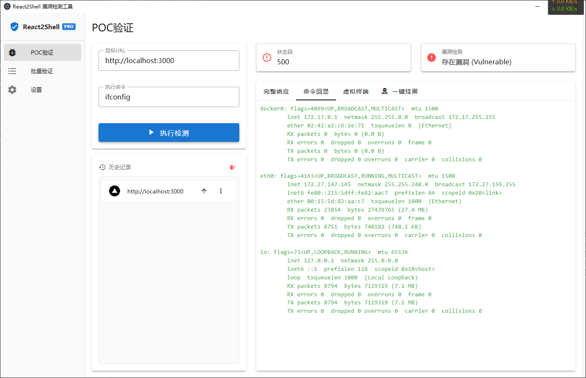
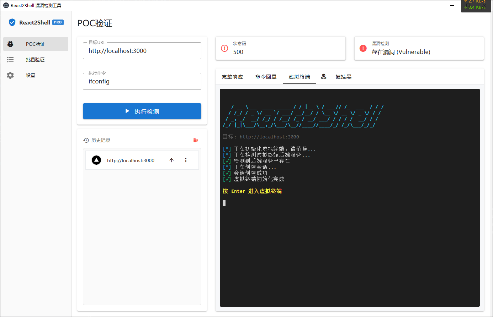
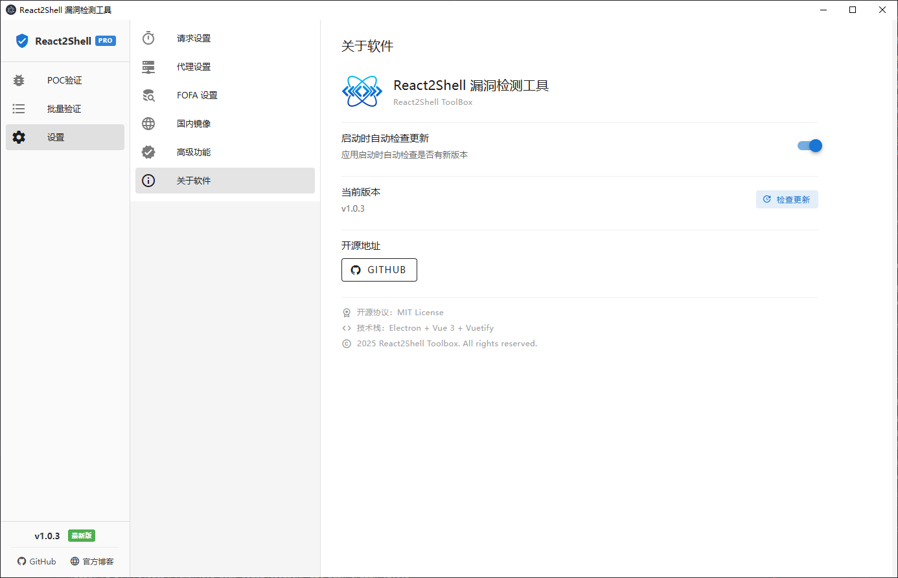

# React2Shell Toolbox

一个基于 Electron + Vue 3 的安全测试工具箱，专注于 React Server Actions 漏洞检测与利用。

## 项目简介

React2Shell Toolbox 是一款针对 Next.js React Server Actions 原型链污染漏洞（CVE-2025-55182）的安全测试工具。该工具提供了友好的图形界面，支持 POC 验证、虚拟终端交互、以及高级的路由劫持功能。

## 应用截图

### POC 验证界面


### 虚拟终端交互


### 设置页面


## 技术架构

### 前端技术栈

- **框架**: Vue 3 (Composition API)
- **UI 库**: Vuetify 3
- **路由**: Vue Router 4
- **代码编辑器**: Monaco Editor
- **终端模拟**: xterm.js
- **语法高亮**: highlight.js
- **构建工具**: Electron Vite

### 后端技术栈

- **运行时**: Electron 39
- **主进程**: Node.js
- **HTTP 客户端**: Axios
- **编码处理**: iconv-lite (支持 GBK/UTF-8 自适应解码)

### 项目结构

```
react2shell-toolbox/
├── src/
│   ├── main/                          # Electron 主进程
│   │   ├── index.js                   # 主进程入口
│   │   ├── poc-handler.js             # POC 执行核心逻辑
│   │   ├── terminal-handler.js        # 虚拟终端处理器
│   │   ├── http-terminal-backend.js   # HTTP 终端后端注入
│   │   ├── storage-handler.js         # 本地存储管理
│   │   └── terminal-backend-injector.js
│   ├── preload/                       # 预加载脚本
│   │   └── index.js                   # IPC 通信桥接
│   └── renderer/                      # 渲染进程（前端）
│       ├── index.html
│       └── src/
│           ├── App.vue                # 主应用组件
│           ├── main.js                # 前端入口
│           ├── router/                # 路由配置
│           ├── views/                 # 页面视图
│           │   ├── POCView.vue        # POC 验证页面
│           │   ├── BatchView.vue      # 批量验证页面
│           │   └── SettingsView.vue   # 设置页面
│           ├── components/            # 公共组件
│           ├── plugins/               # 插件配置
│           └── assets/                # 静态资源
├── resources/                         # 应用资源
├── dist/                              # 构建输出
├── out/                               # 打包输出
├── package.json
├── electron.vite.config.mjs           # Vite 配置
├── electron-builder.yml               # 打包配置
└── README.md
```

## 核心功能

### ✅ 已实现功能

#### 1. POC 验证模块

- **基础检测**: 输入目标 URL 和命令，一键执行漏洞检测
- **状态展示**: 实时显示 HTTP 状态码和漏洞检测结果
- **多视图展示**:
  - 完整响应视图（源码/网页双模式）
  - 命令回显提取
  - 虚拟终端交互（支持 Linux/macOS）
- **历史记录**:
  - 自动保存检测成功的 URL
  - 支持 favicon 显示
  - 快速填充历史 URL
  - 在浏览器中打开
  - 删除/清空历史记录

#### 2. 虚拟终端

- **HTTP SSE 模式**: 基于 Server-Sent Events 的实时终端
- **平台检测**: 自动识别目标服务器操作系统（Windows/Linux/macOS）
- **智能适配**: Windows 平台自动禁用终端功能（暂不支持）
- **交互式 Shell**: 支持命令输入、输出显示、历史记录
- **终端特性**:
  - 光标闪烁
  - 自适应大小
  - 链接识别
  - 滚动缓冲

#### 3. 编码处理

- **自适应解码**: 自动识别并修复 GBK/UTF-8 编码问题
- **平台感知**: 根据目标平台（Windows/Linux）选择正确的编码
- **Base64 处理**: 支持 Base64 编码的命令输出解码
- **乱码修复**: 多种策略修复中文乱码

#### 4. 存储管理

- **历史记录持久化**: 使用 Electron Store 保存检测历史
- **Favicon 缓存**: 自动获取并缓存网站图标
- **跨会话保持**: 应用重启后保留历史数据

#### 5. 自动更新

- **版本检查**: 自动从 GitHub Releases 检查新版本
- **增量更新**: 仅下载必要的更新文件
- **后台下载**: 支持后台下载更新包
- **一键安装**: 下载完成后一键重启安装
- **更新日志**: 显示版本更新内容

### 🚧 未实现功能

#### 1. 批量验证模块

- 批量导入 URL 列表
- 并发检测
- 结果导出（CSV/JSON）
- 进度跟踪
- 失败重试

#### 2. 设置模块

- 代理配置（HTTP/SOCKS5）
- 超时设置
- 并发数控制
- 自定义 Payload 模板
- 主题切换（暗色/亮色）
- 语言切换（中文/英文）

#### 3. 报告生成

- 检测报告导出
- 漏洞详情记录
- 截图功能
- PDF 导出

#### 4. 高级功能

- 自定义 POC 脚本
- 插件系统
- 漏洞数据库
- 自动更新检查

#### 5. Windows 终端支持

- Windows CMD/PowerShell 交互
- Windows 平台的虚拟终端

## 安装与使用

### 环境要求

- Node.js >= 18
- npm >= 9

### 安装依赖

```bash
npm install
```

### 开发模式

```bash
npm run dev
```

### 构建应用

#### 本地构建

```bash
# 构建代码
npm run build

# 打包 Windows 应用 (x64)
npm run build:win

# 打包 macOS 应用 (x64 + arm64 通用)
npm run build:mac

# 打包 macOS 应用 (仅 Intel)
npm run build:mac:x64

# 打包 macOS 应用 (仅 Apple Silicon)
npm run build:mac:arm64

# 打包 Linux 应用 (x64 + arm64)
npm run build:linux

# 打包 Linux 应用 (仅 x64)
npm run build:linux:x64

# 打包 Linux 应用 (仅 arm64)
npm run build:linux:arm64

# 打包所有平台
npm run build:all
```

**构建产物说明：**

- Windows: NSIS 安装程序 + 便携版
- macOS: DMG 磁盘镜像 + ZIP 压缩包 (支持 Intel 和 Apple Silicon)
- Linux: AppImage + DEB + RPM + TAR.GZ (支持 x64 和 arm64)

#### 自动构建（GitHub Actions）

本项目支持通过 GitHub Actions 自动构建所有平台的应用程序：

```bash
# 创建版本标签触发自动构建
git tag v1.0.0
git push origin v1.0.0
```

构建完成后，可以在 GitHub Releases 页面下载对应平台的安装包。详见 [.github/workflows/README.md](.github/workflows/README.md)

### 代码格式化

```bash
npm run format
npm run lint
```

## 使用说明

### POC 验证

1. 在左侧输入目标 URL（例如：`http://localhost:3000`）
2. 输入要执行的命令（例如：`ifconfig`、`whoami`）
3. 点击"执行检测"按钮
4. 查看右侧的检测结果：
   - 状态码卡片显示 HTTP 响应状态
   - 漏洞检测卡片显示是否存在漏洞
   - 切换不同 Tab 查看详细信息

### 虚拟终端

1. 执行 POC 检测并确认存在漏洞
2. 切换到"虚拟终端" Tab
3. 等待终端初始化完成
4. 输入命令并按回车执行
5. 支持命令历史记录（上下箭头）

### 自动更新

1. 进入"设置"页面
2. 在"关于软件"部分点击"检查更新"按钮
3. 如果有新版本，会显示更新对话框
4. 点击"下载更新"开始下载
5. 下载完成后点击"立即安装"重启应用

**注意**: 自动更新功能仅在生产环境（打包后的应用）中可用，开发环境不支持。

### 隐藏功能

（去分析源码找到这个功能吧！）

## 安全警告

⚠️ **本工具仅供安全研究和授权测试使用**

- 请勿在未经授权的系统上使用本工具
- 使用本工具造成的任何后果由使用者自行承担
- 建议仅在受控的测试环境中使用

## 漏洞说明

本工具针对的是 Next.js React Server Actions 的原型链污染漏洞（CVE-2025-55182）。该漏洞允许攻击者通过构造特殊的 FormData 请求，污染 JavaScript 原型链，从而实现远程代码执行。

### 影响版本

- Next.js < 15.1.0
- Next.js < 14.2.22
- Next.js < 13.5.8

### 修复建议

- 升级 Next.js 到最新版本
- 启用严格的输入验证
- 使用 CSP 策略限制脚本执行

## 开发计划

- [ ] 完成批量验证模块
- [ ] 实现设置页面
- [ ] 添加报告生成功能
- [ ] 支持 Windows 终端
- [ ] 添加自定义 POC 脚本
- [ ] 实现插件系统
- [ ] 添加自动更新功能
- [ ] 支持多语言
- [ ] 添加暗色主题

## 贡献指南

欢迎提交 Issue 和 Pull Request！

## 许可证

MIT License

## 致谢

- Next.js 团队
- Electron 社区
- Vue.js 社区
- 所有开源贡献者

---

**免责声明**: 本工具仅用于安全研究和教育目的。使用者应遵守当地法律法规，不得用于非法用途。
