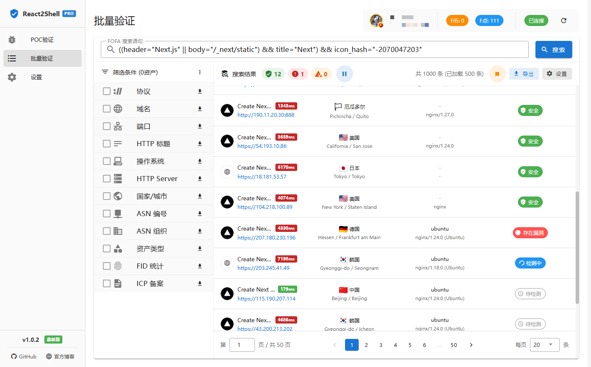

# React2Shell Toolbox

<div align="center">

[](https://github.com/MoLeft/React2Shell-Toolbox/releases)
[](https://github.com/MoLeft/React2Shell-Toolbox/stargazers)
[](https://github.com/MoLeft/React2Shell-Toolbox/network)
[](https://github.com/MoLeft/React2Shell-Toolbox/issues)
[](https://github.com/MoLeft/React2Shell-Toolbox/blob/main/LICENSE)
[](https://github.com/MoLeft/React2Shell-Toolbox/releases)

[](https://www.electronjs.org/)
[](https://vuejs.org/)
[](https://vuetifyjs.com/)
[](https://nodejs.org/)

</div>

一个基于 Electron + Vue 3 的安全测试工具箱，专注于 React Server Actions 漏洞检测与利用。

## 项目简介

React2Shell Toolbox 是一款针对 Next.js React Server Actions 原型链污染漏洞（CVE-2025-55182）的安全测试工具。该工具提供了友好的图形界面，支持 POC 验证、虚拟终端交互、FOFA 资产搜索、以及高级的路由劫持功能。

## 应用截图

### POC 验证界面


### 虚拟终端交互


### 批量验证（FOFA 集成）


### 设置页面


## 核心功能

### ✅ POC 验证模块
- 基础漏洞检测和命令执行
- 完整响应查看（源码/网页双模式）
- 命令回显提取
- 虚拟终端交互（支持 Linux/macOS）
- 历史记录管理（自动保存、favicon 显示）

### ✅ 批量验证模块
- FOFA API 集成（搜索、统计、用户信息）
- 7 种维度统计聚合（协议、域名、端口、标题、系统、服务器、地理位置）
- 智能筛选和多条件组合
- 搜索历史管理
- 请求频率控制和队列管理

### ✅ 高级功能模块
- 密码解锁机制
- 额外的安全测试功能（需解锁）

### ✅ 设置管理
- 请求设置（超时、SSL 证书）
- 代理设置（HTTP/HTTPS/SOCKS5）
- FOFA 设置（API 配置、连接测试）
- 国内镜像（GitHub 加速）
- 版本更新检查

## 下载安装

从 [GitHub Releases](https://github.com/MoLeft/React2Shell-Toolbox/releases) 下载对应平台的安装包：

- **Windows**: `Windows-react2shell-toolbox-{version}-setup.exe` 或 `Windows-react2shell-toolbox-{version}-portable.exe`
- **macOS**: `macOS-react2shell-toolbox-{version}-x64.dmg` (Intel) 或 `macOS-react2shell-toolbox-{version}-arm64.dmg` (Apple Silicon)
- **Linux**: `Linux-react2shell-toolbox-{version}-x64.AppImage` 或 `.deb` / `.tar.gz`

## 从源码构建

### 环境要求
- Node.js >= 18
- npm >= 9

### 安装依赖
```bash
npm install
```

### 开发模式
```bash
npm run dev
```

### 构建应用
```bash
# Windows
npm run build:win

# macOS
npm run build:mac

# Linux
npm run build:linux

# 所有平台
npm run build:all
```

## 使用说明

### POC 验证
1. 输入目标 URL 和命令
2. 点击"执行检测"
3. 查看检测结果和命令回显
4. 切换到"虚拟终端"进行交互

### 批量验证
1. 在设置中配置 FOFA API（[获取凭证](https://fofa.info/userInfo)）
2. 输入 FOFA 搜索语句（如：`app="Apache-Tomcat"`）
3. 加载统计数据并选择筛选条件
4. 查看资产列表（即将推出）

### 高级功能
1. 找到隐藏的解锁入口并输入密码
2. 解锁后可使用额外的安全测试功能

## 技术架构

- **前端**: Vue 3 + Vuetify 3 + Vue Router 4
- **后端**: Electron 39 + Node.js
- **编辑器**: Monaco Editor
- **终端**: xterm.js
- **构建**: Electron Vite + Electron Builder

## 安全警告

⚠️ **本工具仅供安全研究和授权测试使用**

- 请勿在未经授权的系统上使用
- 使用本工具造成的任何后果由使用者自行承担
- 建议仅在受控的测试环境中使用

## 漏洞说明

本工具针对 Next.js React Server Actions 的原型链污染漏洞（CVE-2025-55182）。

### 影响版本
- Next.js < 15.1.0
- Next.js < 14.2.22
- Next.js < 13.5.8

### 修复建议
- 升级 Next.js 到最新版本
- 启用严格的输入验证
- 使用 CSP 策略限制脚本执行

## 开发计划

- [x] POC 验证模块
- [x] 虚拟终端交互
- [x] 设置管理（请求、代理、FOFA、镜像）
- [x] 版本更新检查
- [x] FOFA API 集成
- [x] 统计聚合和筛选
- [x] 高级功能模块
- [ ] 批量资产列表展示
- [ ] 批量 POC 检测
- [ ] 检测结果导出
- [ ] 多语言支持
- [ ] 暗色主题

## 许可证

MIT License

## 贡献者

感谢所有为本项目做出贡献的开发者！

<a href="https://github.com/MoLeft/React2Shell-Toolbox/graphs/contributors">
  
</a>

### 如何贡献

我们欢迎各种形式的贡献，包括但不限于：

- 🐛 报告 Bug
- 💡 提出新功能建议
- 📝 改进文档
- 🔧 提交代码修复或新功能

请查看 [Issues](https://github.com/MoLeft/React2Shell-Toolbox/issues) 页面参与讨论，或直接提交 Pull Request。

## Star 历史

[](https://star-history.com/#MoLeft/React2Shell-Toolbox&Date)

## 致谢

- Next.js 团队
- Electron 社区
- Vue.js 社区
- FOFA 团队
- 所有开源贡献者

---

**免责声明**: 本工具仅用于安全研究和教育目的。使用者应遵守当地法律法规，不得用于非法用途。
