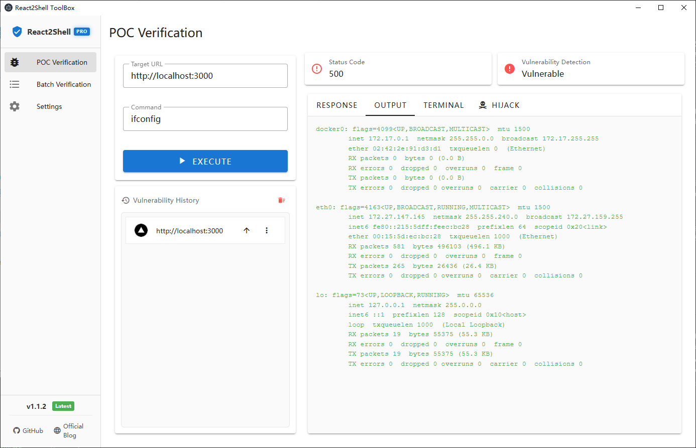
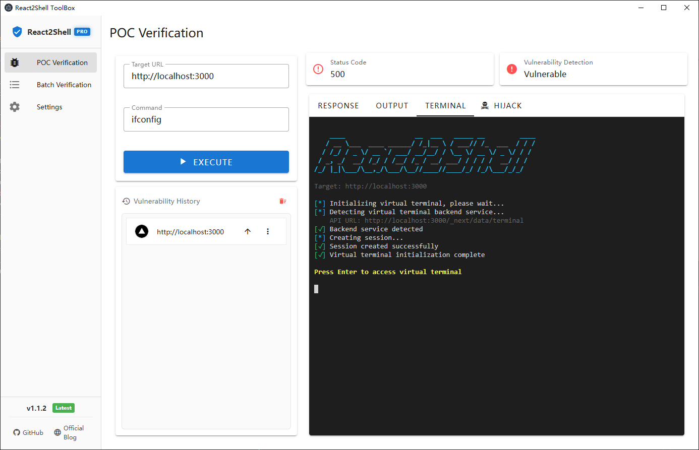
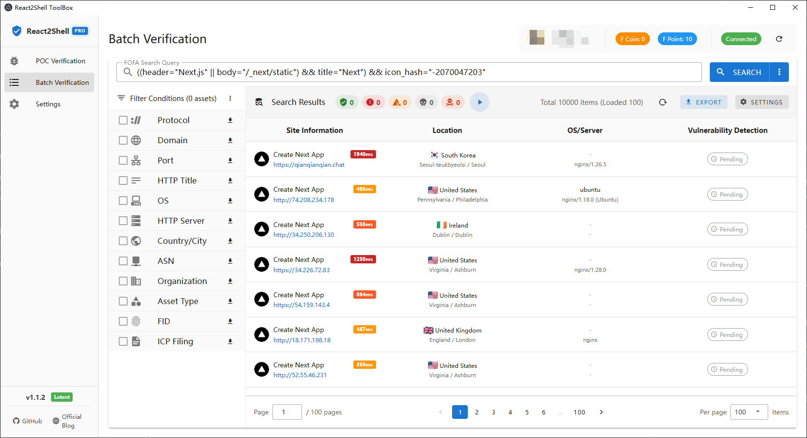
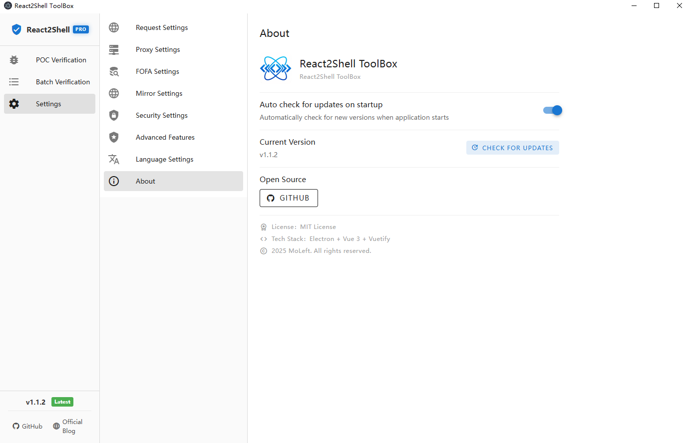

<div align="center">

# React2Shell Toolbox

[](https://github.com/MoLeft/React2Shell-Toolbox/releases)
[](https://github.com/MoLeft/React2Shell-Toolbox/stargazers)
[](https://github.com/MoLeft/React2Shell-Toolbox/network)
[](https://github.com/MoLeft/React2Shell-Toolbox/issues)
[](https://github.com/MoLeft/React2Shell-Toolbox/blob/main/LICENSE)
[](https://github.com/MoLeft/React2Shell-Toolbox/releases)

[](https://www.electronjs.org/)
[](https://vuejs.org/)
[](https://vuetifyjs.com/)
[](https://nodejs.org/)

A security testing toolkit built with Electron + Vue 3, focused on React Server Actions vulnerability detection and exploitation.

[中文文档](README_CN.md) | English

</div>

## Overview

React2Shell Toolbox is a security testing tool designed for Next.js React Server Actions prototype pollution vulnerability (CVE-2025-55182). It provides a user-friendly GUI with features including POC verification, virtual terminal interaction, FOFA asset search, and advanced route hijacking capabilities.

## Screenshots

### POC Verification


### Virtual Terminal


### Batch Verification (FOFA Integration)


### Settings


## Core Features

### ✅ POC Verification Module
- Basic vulnerability detection and command execution
- Full response viewing (source/preview dual mode)
- Command output extraction
- Virtual terminal interaction (Linux/macOS support)
- History management (auto-save, favicon display)
- Monaco Editor integration

### ✅ Batch Verification Module
- FOFA API integration (search, statistics, user info)
- 7 dimensions of statistical aggregation (protocol, domain, port, title, OS, server, location)
- Smart filtering and multi-condition combination
- Search history management
- Request rate control and queue management
- User info display (avatar, VIP status, F-coin/F-point balance)

### ✅ Settings Management
- Request settings (timeout, SSL certificate)
- Proxy settings (HTTP/HTTPS/SOCKS5)
- FOFA settings (API configuration, connection test, proxy bypass)
- China mirror (GitHub acceleration)
- Auto-update check (optional)
- Advanced features configuration (requires authorization)

## Download & Installation

Download the installer for your platform from [GitHub Releases](https://github.com/MoLeft/React2Shell-Toolbox/releases):

- **Windows**: `Windows-react2shell-toolbox-{version}-setup.exe` or `Windows-react2shell-toolbox-{version}-portable.exe`
- **macOS**: `macOS-react2shell-toolbox-{version}-x64.dmg` (Intel) or `macOS-react2shell-toolbox-{version}-arm64.dmg` (Apple Silicon)
- **Linux**: `Linux-react2shell-toolbox-{version}-x64.AppImage` or `.deb` / `.tar.gz`

## Build from Source

### Requirements
- Node.js >= 18
- npm >= 9

### Install Dependencies
```bash
npm install
```

### Development Mode
```bash
npm run dev
```

### Build Application
```bash
# Windows
npm run build:win

# macOS
npm run build:mac

# Linux
npm run build:linux

# All platforms
npm run build:all
```

## Usage Guide

### POC Verification
1. Enter target URL and command
2. Click "Execute Detection"
3. View detection results and command output
4. Switch to "Virtual Terminal" for interaction

### Batch Verification
1. Configure FOFA API in settings ([Get credentials](https://fofa.info/userInfo))
2. Enter FOFA search query (e.g., `app="Apache-Tomcat"`)
3. Load statistics and select filter conditions
4. View asset list (coming soon)

## Tech Stack

### Frontend
- **Framework**: Vue 3 (Composition API)
- **UI Library**: Vuetify 3 (Material Design)
- **Router**: Vue Router 4
- **State Management**: Pinia
- **Code Editor**: Monaco Editor
- **Terminal**: xterm.js + xterm-addon-fit

### Backend
- **Runtime**: Electron 39 + Node.js 18+
- **Build Tools**: Electron Vite + Electron Builder
- **HTTP Client**: Axios + Node Fetch
- **Proxy Support**: https-proxy-agent + socks-proxy-agent
- **Markdown Rendering**: marked + highlight.js

### Project Structure
```
react2shell-toolbox/
├── src/
│   ├── main/                      # Electron main process
│   │   ├── index.js              # Main process entry
│   │   ├── poc-handler.js        # POC execution handler
│   │   ├── terminal-handler.js   # Virtual terminal handler
│   │   ├── fofa-handler.js       # FOFA API handler
│   │   ├── github-oauth-handler.js # GitHub OAuth handler
│   │   ├── storage-handler.js    # Storage management handler
│   │   └── updater.js            # Auto-update handler
│   ├── preload/                   # Preload scripts
│   │   └── index.js              # IPC communication bridge
│   └── renderer/                  # Renderer process (frontend)
│       ├── src/
│       │   ├── components/       # Vue components
│       │   │   ├── poc/         # POC verification components
│       │   │   ├── batch/       # Batch verification components
│       │   │   └── settings/    # Settings components
│       │   ├── views/           # Page views
│       │   ├── stores/          # Pinia state management
│       │   ├── router/          # Router configuration
│       │   ├── composables/     # Composable functions
│       │   └── App.vue          # Root component
│       └── index.html           # HTML entry
├── resources/                     # Application resources
│   ├── icon.png                 # App icon
│   └── icon.ico                 # Windows icon
├── changelog/                     # Version changelogs
├── electron-builder.yml          # Build configuration
└── package.json                  # Project configuration
```

### Core Modules

#### Main Process Modules
- **poc-handler**: Handles POC execution requests with proxy and SSL certificate bypass support
- **terminal-handler**: Manages virtual terminal sessions and SSE streams
- **fofa-handler**: Wraps FOFA API for search, statistics, and user info queries
- **github-oauth-handler**: Implements GitHub OAuth2 flow and Star verification
- **storage-handler**: Manages local storage (settings, history, favicon cache)
- **updater**: Handles auto-update checks and downloads

#### Renderer Process Modules
- **stores**: Global state management with Pinia (app, settings, POC, FOFA, update)
- **composables**: Reusable composition functions (POC hijacking, terminal management, etc.)
- **components**: Modular Vue components organized by functionality

#### IPC Communication
- Uses Electron IPC for main-renderer process communication
- Safely exposes APIs to renderer via contextBridge
- Supports bidirectional communication and event listening

## Security Warning

⚠️ **This tool is for security research and authorized testing only**

- Do not use on unauthorized systems
- Users are responsible for any consequences
- Recommended for use in controlled testing environments only

## Vulnerability Details

This tool targets the Next.js React Server Actions prototype pollution vulnerability (CVE-2025-55182).

### Affected Versions
- Next.js < 15.1.0
- Next.js < 14.2.22
- Next.js < 13.5.8

### Mitigation
- Upgrade Next.js to the latest version
- Enable strict input validation
- Use CSP policies to restrict script execution

## Roadmap

### Completed ✅
- [x] POC verification module
- [x] Virtual terminal interaction
- [x] Settings management (request, proxy, FOFA, mirror)
- [x] Version update check
- [x] FOFA API integration
- [x] Statistical aggregation and filtering
- [x] Advanced features (POC hijacking, batch hijacking)
- [x] Monaco Editor integration
- [x] Cross-platform URL Scheme support

### In Progress 🚧
- [ ] Batch asset list display
- [ ] Batch POC detection
- [ ] Detection result export

### Planned 📋
- [x] Multi-language support (Simplified Chinese/English)
- [ ] Dark theme
- [ ] Plugin system
- [ ] Custom POC templates
- [ ] Detection report generation

## License

MIT License

## Contributors

Thanks to all contributors who have helped this project!

<a href="https://github.com/MoLeft/React2Shell-Toolbox/graphs/contributors">
  
</a>

### How to Contribute

We welcome all forms of contributions, including but not limited to:

- 🐛 Bug reports
- 💡 Feature suggestions
- 📝 Documentation improvements
- 🔧 Code fixes or new features

Please check the [Issues](https://github.com/MoLeft/React2Shell-Toolbox/issues) page to participate in discussions, or submit a Pull Request directly.

## Star History

[](https://star-history.com/#MoLeft/React2Shell-Toolbox&Date)

## Acknowledgments

- Next.js Team
- Electron Community
- Vue.js Community
- FOFA Team
- All open-source contributors

---

**Disclaimer**: This tool is for security research and educational purposes only. Users should comply with local laws and regulations and must not use it for illegal purposes.
